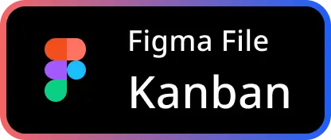

# A Multiplatform Wiki for Zenless Zone Zero

**ZZZ Archive** is a Zenless Zone Zero Wiki app, built with Compose Multiplatform to deliver a smooth and consistent experience across platforms. ZZZ Archive lets players access detailed information on characters, weapons, Bangboo, and Drive Disc from the game, as well as explore popular second creations by fans.

**ZZZ Archive** 是 "絕區零" 的維基應用程式，透過 Compose Multiplatform 打造跨平台一致的使用體驗。用戶可查詢角色、武器、邦布和驅動光碟資訊，並且瀏覽熱門的二創作品。

---
### Adaptive Layout

## Download

## UI Design

## Kanban (Realtime)

## Running on Desktop / 桌面端執行方法

1. [Set up your environment](https://www.jetbrains.com/help/kotlin-multiplatform-dev/multiplatform-setup.html)
2. In Android Studio, go to **Run** > **Edit Configurations** > **New** > **Gradle**.
3. Configure as follows:
  - Run: `desktopRun -DmainClass=MainKt --quiet`
  - Environment Variables: `VARIANT=Dev`

## Tech Stack / 使用技術

- **Kotlin Multiplatform (KMP)**
- **Compose Multiplatform (CMP)**
- Adaptive Layout for dynamic screen adjustment
- Compose Navigation
- ViewModel Lifecycle Management (JetBrains Lifecycle ViewModel)
- Koin for Dependency Injection
- Ktor for Networking
- Localization support (English and Traditional Chinese)
- Full-screen edge-to-edge layout
- **Design System**
  - Custom UI Components
  - Dark/Light Color Schemes
  - Noto Sans Typography
  - Spacing and Radius adjustments
- BuildKonfig for environment configurations

## Special Thanks / 鳴謝

- Resources from [Zenless Zone Zero](https://zenless.hoyoverse.com/) and [Zenless Zone Zero Wiki](https://zenless-zone-zero.fandom.com/wiki/Zenless_Zone_Zero_Wiki)
- [Philipp Lackner’s YouTube Channel](https://www.youtube.com/@PhilippLackner)
- [JetBrains KMP Guidelines](https://www.jetbrains.com/help/kotlin-multiplatform-dev/get-started.html)
- [Android Developer Guidelines](https://developer.android.com/)
- [Android Open Source Project](https://github.com/android)
- [Compose Multiplatform Wizard](https://github.com/terrakok/Compose-Multiplatform-Wizard)
- [BuildKonfig for KMP](https://sujanpoudel.me/blogs/managing-configurations-for-different-environments-in-kmp/)
- [Release macOS App](https://www.marcogomiero.com/posts/2024/compose-macos-app-store/)
- Cover Artist [EDIBLE](https://www.pixiv.net/users/75576278)